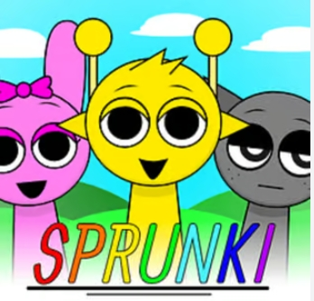

# Sprunki But Human: A Fun and Exciting Adventure Game

## Introduction

Hey there! Are you ready to dive into an amazing world of adventure, mystery, and fun? Let me introduce you to **Sprunki But Human**, a super cool game that’s been making waves in the gaming community. Whether you’re a seasoned gamer or just looking for something new to play, this game has something for everyone. So, grab your controller, sit back, and let’s explore everything about **Sprunki But Human**!

**👉👉 Click to play*: [Sprunki But Human](https://sprunkibuthuman.pages.dev) 

## What is Sprunki But Human?

**Sprunki But Human** is an action-adventure game that combines elements of exploration, puzzle-solving, and combat. The game is set in a vibrant and colorful world filled with strange creatures, hidden treasures, and challenging obstacles. You play as Sprunki, a curious and brave character who looks human but has some unique abilities that set them apart from ordinary people.

## The Storyline

The story of **Sprunki But Human** begins in a small, peaceful village called Lumina. Sprunki has always felt different from the other villagers. They have this strange power to manipulate objects with their mind, which makes them both special and a bit of an outcast. One day, while exploring the nearby forest, Sprunki stumbles upon an ancient artifact that unlocks a hidden portal to another dimension.

This new dimension is called **Zyntheria**, a land filled with magical creatures, dangerous enemies, and ancient secrets. Sprunki soon discovers that they are the chosen one, destined to save Zyntheria from an evil force known as the **Dark Veil**. The Dark Veil is spreading across the land, corrupting everything in its path. It’s up to Sprunki to gather the power of the four Elemental Crystals and restore balance to Zyntheria.

## Gameplay

**Sprunki But Human** offers a mix of different gameplay elements that keep things exciting and engaging. Here’s a breakdown of what you can expect:

### Exploration

One of the best parts of the game is exploring the vast and beautiful world of Zyntheria. There are forests, mountains, deserts, and underwater caves to discover. Each area is filled with hidden paths, secret treasures, and side quests that add depth to the game. You’ll need to use Sprunki’s special abilities to navigate through these areas and uncover all the secrets.

### Puzzle-Solving

Throughout the game, you’ll encounter various puzzles that require both logic and creativity to solve. These puzzles range from simple tasks like matching symbols to more complex challenges that involve manipulating the environment. Solving these puzzles often rewards you with valuable items or access to new areas.

### Combat

Of course, no adventure game would be complete without some action-packed combat! Sprunki can use a variety of weapons and abilities to take on enemies. As you progress through the game, you’ll unlock new skills and upgrades that make combat even more exciting. You’ll face off against a wide range of enemies, from small critters to giant bosses, each with their own unique attack patterns and weaknesses.

### Crafting and Upgrades

In **Sprunki But Human**, you can collect materials from the environment to craft new items and upgrades. Whether it’s potions to heal yourself or enhancements for your weapons, crafting plays a big role in your success. You’ll need to gather resources and experiment with different combinations to find the best recipes.

### Character Development

As you complete quests and defeat enemies, Sprunki will gain experience points and level up. Leveling up allows you to improve your stats and unlock new abilities. You can customize Sprunki’s skills to match your playstyle, whether you prefer to focus on combat, exploration, or a mix of both.

## Graphics and Sound

One of the first things you’ll notice about **Sprunki But Human** is its stunning graphics. The game features a colorful and detailed art style that brings the world of Zyntheria to life. Each area has its own unique look and feel, from the lush greenery of the forests to the eerie glow of the Dark Veil.

The sound design is equally impressive. The game’s soundtrack is filled with catchy tunes that match the mood of each area. Whether you’re exploring a peaceful village or battling a fierce enemy, the music adds to the overall experience. The sound effects are also well-done, making every action feel impactful and satisfying.

## Multiplayer Mode

**Sprunki But Human** also offers a multiplayer mode where you can team up with friends to explore Zyntheria together. In this mode, you can work together to solve puzzles, defeat enemies, and complete quests. It’s a great way to experience the game with others and adds a whole new layer of fun.

## Tips and Tricks

Here are some tips to help you get started in **Sprunki But Human**:

1. **Explore Everywhere**: Don’t rush through the game. Take your time to explore every nook and cranny. You never know what treasures or secrets you might find.

2. **Upgrade Your Gear**: Make sure to regularly upgrade your weapons and armor. This will make combat easier and help you take on tougher enemies.

3. **Experiment with Crafting**: Don’t be afraid to try out different crafting recipes. You might discover some powerful items that give you an edge in battle.

4. **Learn Enemy Patterns**: Each enemy has its own attack patterns and weaknesses. Pay attention to these and adjust your strategy accordingly.

5. **Complete Side Quests**: Side quests are a great way to earn extra experience points and rewards. They also add more depth to the story and world.

## Conclusion

**Sprunki But Human** is an incredible game that offers a perfect blend of adventure, action, and exploration. With its captivating storyline, beautiful graphics, and engaging gameplay, it’s no wonder that so many people are falling in love with this game. Whether you’re playing solo or with friends, there’s always something new and exciting to discover in the world of Zyntheria.

So, what are you waiting for? Grab your copy of **Sprunki But Human** today and embark on an unforgettable journey! Happy gaming!

---

**👉👉 Click to play*: [Sprunki But Human](https://sprunkibuthuman.pages.dev) 
